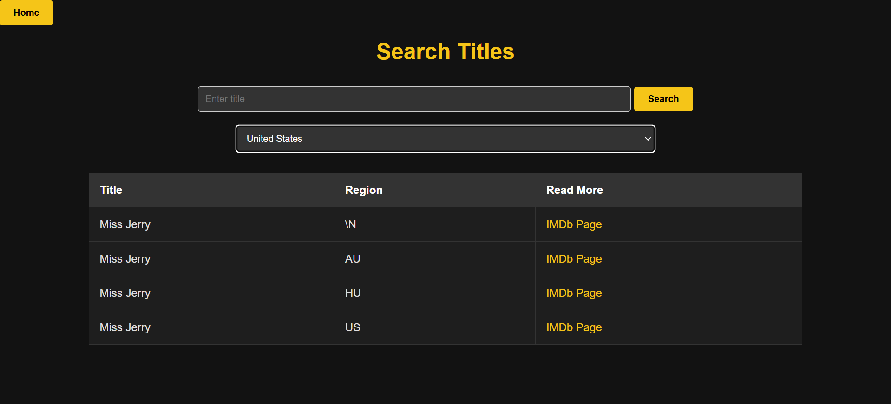
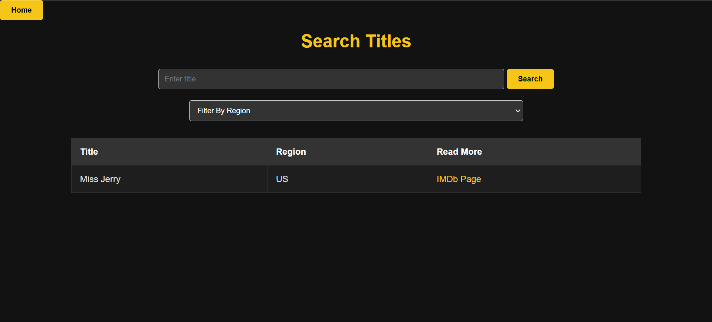

# Film Search Application

This is a Spring Boot application for searching film titles by title and region. The application reads film data from a TSV file and stores it in a database.

## Features

- Search films by title
- Filter films by region
- Auto-submit form on region selection
- Navigate back to the home page

## Technologies Used

- Java
- Spring Boot
- Maven
- Thymeleaf
- Apache Commons CSV
- JDBC

## Getting Started

### Prerequisites

- Java 11 or higher
- Maven 3.6.0 or higher
- A database (e.g., MySQL, PostgreSQL)

### Installation

1. Clone the repository:
   ```sh
   git clone https://github.com/oremowaiye/film-search.git
   cd film-search

### Database Setup

1. **Prepare the Database File**:
    - Ensure you have the TSV file containing the film data. The file should be named `title.akas (2).tsv` and placed in the `src/main/resources/` directory.

2. **Update the Database Configuration**:
-
   Open the `src/main/resources/application.properties` file and update the database connection details:
     ```
  spring.datasource.url=jdbc:h2:mem:testdb
    spring.datasource.driverClassName=org.h2.Driver
    spring.datasource.username=sa
    spring.datasource.password=
    spring.jpa.database-platform=org.hibernate.dialect.H2Dialect
    spring.h2.console.enabled=true
    spring.jpa.properties.hibernate.jdbc.batch_size=300
    spring.jpa.properties.hibernate.order_inserts=true
    spring.jpa.properties.hibernate.flush.mode=COMMIT
    ```
3. **Run the Application**:
    - Build and run the application using Maven:
      ```sh
      mvn clean install
      mvn spring-boot:run
      ```

4. **Verify Data Loading**:
    - The application will read the `title.akas (2).tsv` file and load the data into the database upon startup. You can verify the data by querying the database.

### Configuration
You can change the limit of records processed by modifying the `recordLimit` variable in the `readAndSaveData` method of the `Main` class. Here is the relevant part of the code:

```java
public void readAndSaveData() {
    int recordLimit = 100000; // Change this value to set a different limit
    int processedCount = 0;

    // Rest of the code...
}


```
###Images

# Home Page


# Search Results



# Filter By Region

